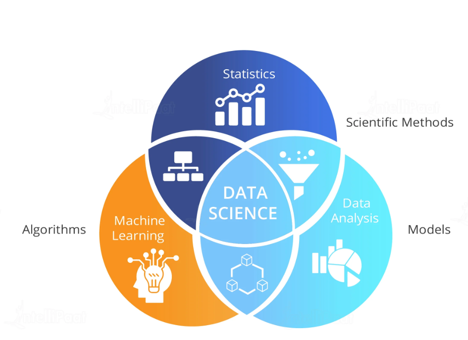
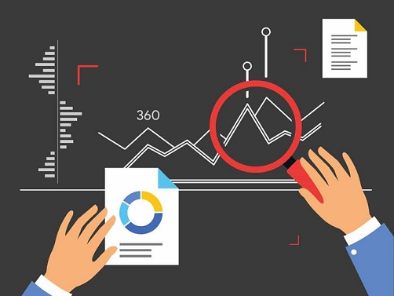
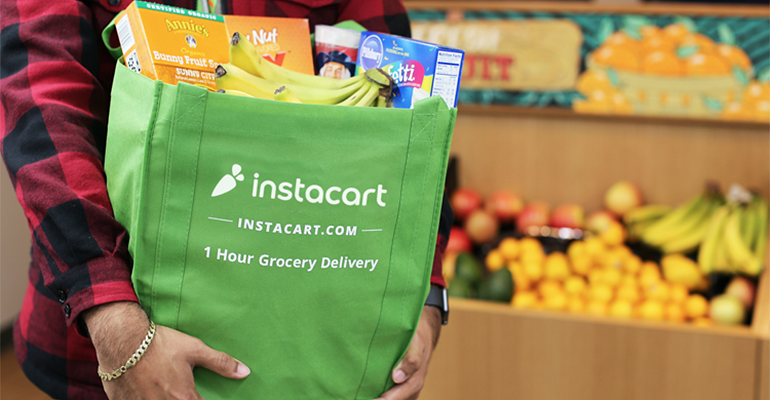
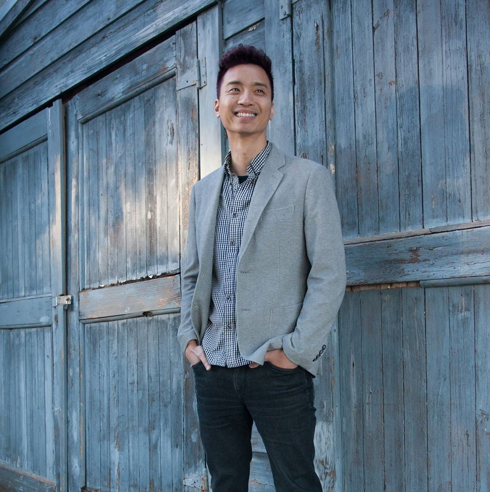

 

## Why Data Science?
I always look for projects which allow me to identify “efficiency,” be it process improvement that saves labor hours, or forecasting spending decision to save money. I enjoy seeking the “optimal” solution for problems.
 
We are exposed to a massive volume of data like never before; the opportunity of finding efficiency becomes limitless. Data Science is an excellent tool to comb through layers of data to identify the “golden eggs” within. Thanks to user-friendly programming languages like Python, I can combine my business experience and be self-sufficient in tackling problems with Big Data.
    
## Technical Skills
   - Python, SQL, Tableau, DataBrick, Hadoop, Excel(include Power Query, Power Desktop),ODBC, PowerShell

## Functional Experience
   - Data Science (2 years)
   - Sales Planning (2.5 years)
   - Supply Chain/ Inventory Planning (4 years)
   - Finance/Accounting (5 years)
   - [Resume](https://resume.creddle.io/resume/2p53mcka0ik)
   
## Projects
   [**Lending Club Repayment** ](https://github.com/sittingman/lending_repayment)
   - **Objective**: Predict the likelihood of paid off for loans based on information provided by borrowers at the point of application. The model should be able to screen out high risk loan requests and not rejecting good loans request by mistake. 
   - Model applied : Logistics Regression, Random Forecast.

   [**Sales Forecast** ](https://github.com/sittingman/sales_forecast)
   - **Objective**: Given 34 months of sales history (Jan 2013 – Oct 2015) of a gaming retailer by items and by shops, predict sales for Nov 2015 (period 35)
   - Models applied: ARMA, SARIMA, Holt Winter, Prophet, VARMAX, Xgboost, Random Forest, Rigde
       
   [**Instacart Market Basket Analysis** ](https://github.com/sittingman/instacart_product_repurchase)
   - **Objective** : Predict products mixes that will be included in the next purchase order by users
   - Model applied : Gradient Boosting, Lightgbm, Xgboost, Random Forest

   [**Mini Project** ](https://github.com/sittingman/takehome_proj)
   - Small project challenges

## About Me:
   - A native Hongkongers, fellow Bruin, in love with dance and foreign languages
   - Favorite: book author (Peter Drucker), musician (Michael Jackson), dance (Tap)
   - Big focus on continue education, pursuing two micromaster degrees (Supply Chain and Development Policy/Economic), practicing Spanish and Japanese on the side
    
    
         

